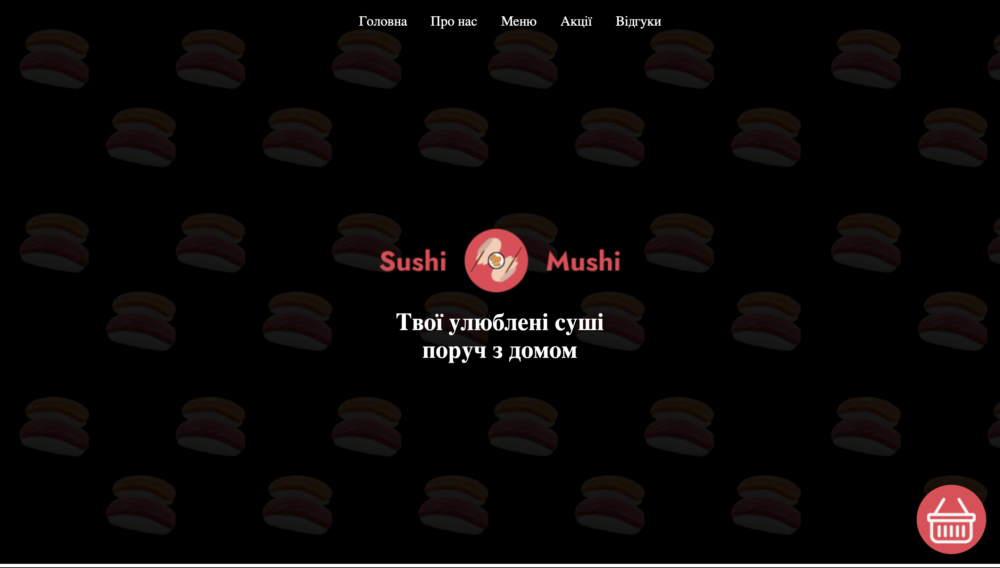
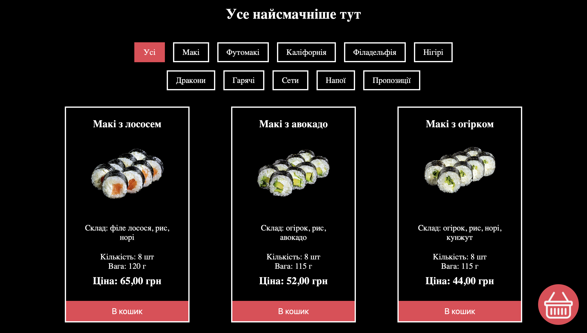
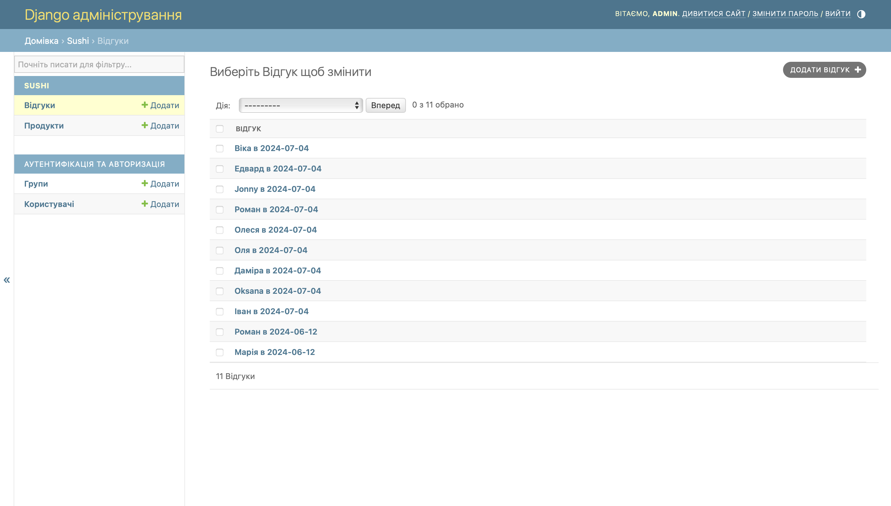
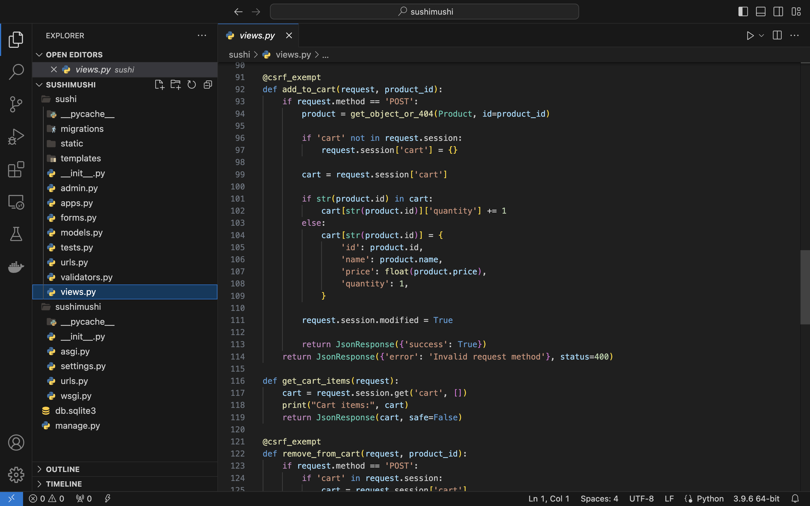

# 🍣 SushiMushi — Сайт доставки суші

## 📝 Опис

**SushiMushi** — це вебдодаток для оформлення замовлень суші з доставкою. Розроблено з використанням фреймворку **Django** та бази даних **SQLite**. Призначений для адміністрування меню, обробки замовлень і зручного інтерфейсу для користувачів.

## ⚙️ Функціональність

- Перегляд меню суші з цінами, фото та описами
- Додавання товарів у кошик
- Оформлення замовлення з вказанням контактної інформації
- Адмін-панель для керування меню та замовленнями

## 🛠️ Технології

- Python 3
- Django
- SQLite (вбудована БД)
- HTML/CSS
- Django Templates
- JavaScript ( для взаємодії з кошиком)

# Запуск локального сервера
python manage.py runserver

## 🖼️ Інтерфейс

Приклад інтерфейсу програми:

